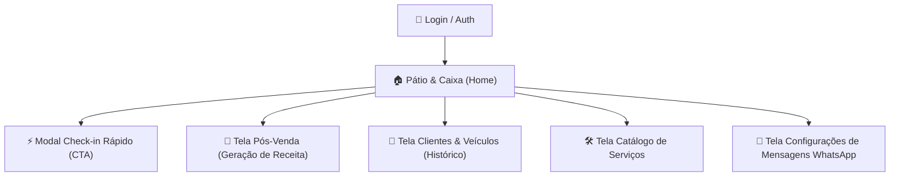

# 📋 Documento de Requisitos de Produto (PRD) — GestAuto MVP

## 1. Visão Geral e Posicionamento Competitivo

### 1.1 Objetivo do MVP
Construir um produto enxuto, extremamente rápido e com **ROI visível imediato**, focado na **rotina de chão de oficina e geração de receita recorrente**, para validação da proposta de valor diretamente com os primeiros 5 a 10 donos de estéticas automotivas e oficinas.

### 1.2 Posicionamento: GestAuto vs. Plataforma CERA
*   **O problema do concorrente (CERA):** A CERA vende um módulo de robô de WhatsApp caro (CERA Zap) como produto separado para pós-venda. Além disso, a ferramenta tornou-se inchada ("100+ funções"), afastando quem busca agilidade.
*   **A proposta do GestAuto:** Foco em **Simplicidade Extrema + Dinheiro no Bolso**. Em menos de 60 segundos o operador dá entrada no carro e, diariamente, o sistema entrega uma lista de **Pós-Venda mastigada** para ele reativar clientes antigos com 1 toque no WhatsApp a custo zero.

---

## 2. Estrutura de Telas do MVP

---

## 3. Especificação Detalhada das Telas

### 3.1 Tela 1: Pátio & Caixa do Dia (Home / Kanban)
*   **Métricas do Topo:**
    *   `Carros no Pátio Hoje` | `Faturado Hoje (R$)` | `A Receber (R$)` | **`Pós-Venda Pendente Hoje (X clientes para chamar)`**.
*   **Botão de Ação Rápida (CTA Primário):**
    *   `+ Nova Entrada (Check-in)` ➔ Abre o modal/gaveta rápida de entrada.
*   **Quadro Kanban (4 colunas):**
    1.  `Aguardando` ➔ Carros no pátio esperando liberação.
    2.  `Em Execução` ➔ Sendo lavados, polidos ou higienizados.
    3.  `Pronto para Retirada` ➔ Serviço pronto; destaque no botão `💬 Avisar no WhatsApp`.
    4.  `Entregue` ➔ Carros entregues e pagos hoje (seleciona meio de pagamento: Pix, Cartão, Dinheiro). Ao entregar, agenda automaticamente o Pós-Venda baseado no serviço realizado!

---

### 3.2 Modal / Gaveta de Check-in Rápido (CTA da Home)
*   *Propósito:* Registro imediato quando o carro entra no portão.
*   **Auto-complete de Placa:** Se a placa já existir no banco, preenche automaticamente os dados do cliente e modelo.
*   **Seleção de Serviços:** Checkbox com os serviços cadastrados no catálogo (com preço e dias de pós-venda vinculados).
*   **Ação:** Botão *"Dar Entrada no Pátio"* ➔ Gera o card no Kanban.

---

### 3.3 Tela 2: Central de Pós-Venda (O Maior Argumento de Venda da Plataforma)
*   *Propósito:* Fazer a oficina faturar mais todo mês lembrando clientes de serviços de manutenção preventiva, higienização periódica ou retorno de vitrificação.
*   **Como funciona o motor:**
    *   Cada serviço no catálogo define o tempo de pós-venda (ex: *Lavagem Técnica* = 20 dias; *Manutenção de Cera* = 60 dias; *Vitrificação* = 180 dias).
    *   Quando uma OS é marcada como `Entregue`, o sistema programa o contato para `Data de Hoje + Dias de Pós-Venda`.
*   **Interface da Tela:**
    *   Filtro: `Contatos de Hoje` | `Atrasados` | `Próximos 7 Dias` | `Histórico`.
    *   Card de cada contato:
        *   Nome do Cliente e Telefone.
        *   Carro e Placa.
        *   Último serviço feito e há quantos dias foi realizado.
        *   **Botão Verde de Destaque:** `💬 Chamar no WhatsApp` (Abre o WhatsApp com mensagem persuasiva e personalizada de recall).
        *   Ações rápidas: `Marcar como Contatado` | `Cliente Reagendou` | `Ignorar`.

---

### 3.4 Tela 3: Gestão de Clientes & Veículos (Histórico Completo)
*   *Propósito:* Consultar histórico, reencontrar clientes antigos e editar cadastros sem pressa.
*   **Funcionalidades:**
    *   Barra de pesquisa unificada: busca em tempo real por **Nome**, **Placa**, **Telefone** ou **Modelo**.
    *   Lista de clientes com resumo: Nome, WhatsApp, Carros vinculados e total gasto na oficina.
    *   **Detalhe do Cliente (Drawer/Modal):**
        *   Veículos cadastrados.
        *   Histórico de Ordens de Serviço anteriores com datas e valores.
        *   Status do Pós-venda (se tem contato agendado).

---

### 3.5 Tela 4: Catálogo de Serviços (Tabela de Preços & Pós-Venda)
*   *Propósito:* Padronizar os serviços, valores e a frequência recomendada de retorno.
*   **Campos do Serviço:**
    *   `Nome do Serviço` (ex: *Lavagem Técnica*, *Polimento Comercial*, *Vitrificação*).
    *   `Preço Padrão (R$)`.
    *   `Tempo Estimado (minutos/horas)`.
    *   `Dias para Retorno / Pós-Venda` (ex: 30 dias para lavagem, 180 dias para vitrificador).
    *   `Descrição / Observações`.
    *   `Status` (Ativo / Inativo).

---

### 3.6 Tela 5: Modelos de Mensagem do WhatsApp (Configuração de Templates)
*   *Propósito:* Personalização do tom de voz com variáveis automáticas `{cliente}`, `{carro}`, `{placa}`, `{servicos}`, `{valor}`, `{oficina}`, `{pix}`.
*   **Templates Pré-Configurados:**
    1.  **Entrada / Orçamento:** Confirmação de entrada e valores.
    2.  **Carro Pronto (Retirada):** Aviso de conclusão do serviço + chave Pix.
    3.  **Pós-Venda / Retorno:**
        > *"Olá, {cliente}! Já faz um tempo que cuidamos do seu {carro} aqui na {oficina}. Pelo tempo decorrido, está na hora ideal de fazer a manutenção do serviço de {servicos} para manter a proteção em dia. Quer agendar seu horário para essa semana?"*

---

## 4. Decisões de Arquitetura e Tecnologia

*   **Arquitetura do Projeto:** Monorepo simples com o frontend localizado na pasta `/frontend` na raiz do repositório.
*   **Frontend Stack:**
    *   **Framework:** Next.js (App Router, React, TypeScript).
    *   **Estilização:** Tailwind CSS.
    *   **Componentes de UI:** shadcn/ui (Radix Primitives) + Lucide Icons.
    *   **Consumo da API Fastify:** TanStack Query (React Query) + Axios / Fetch nativo.
*   **Backend Support:** O modelo Prisma já possui a tabela `PosVenda` e o campo `tempo_pos_venda` em `Servico`. A regra de agendamento automático será conectada na finalização da OS.

---

## 5. Critérios de Sucesso para Validação
1. O dono da oficina conseguir registrar um veículo em **menos de 60 segundos**.
2. O dono da oficina conseguir reativar pelo menos **2 a 3 clientes na primeira semana** usando a tela de Pós-Venda.
3. O software se provar indispensável gerando faturamento direto através do recall de clientes.
