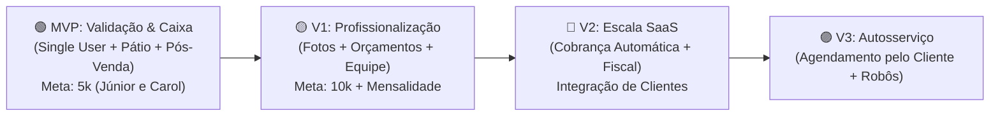

# 🚗 GestAuto / Eixo — Especificação de Produto & Visão Estratégica

---

## 1. O que é o Produto?

O **GestAuto** (ou **Eixo**) é uma plataforma de gestão operacional e aceleração de receita desenvolvida especificamente para negócios automotivos de alto valor agregado. 

Diferente de sistemas genéricos de balcão ou softwares saturados de complexidade (como a Plataforma CERA, que possui mais de 100 funções difíceis de operar no celular), o GestAuto foi desenhado com um princípio central: **Simplicidade Extrema, Controle Visual do Pátio e Retenção Ativa de Clientes (Pós-Venda)**.

O produto resolve as duas maiores dores de um centro automotivo:
1. **Desorganização Operacional:** Saber exatamente quem está agendado para o dia, o que está sendo executado nos boxes agora e quais carros devem ser entregues.
2. **Perda de Dinheiro no Pós-Venda:** Elimina o esquecimento de manutenções e revisões (vitrificações, polimentos e lavagens técnicas), avisando o proprietário automaticamente sobre quem ele deve reativar para colocar dinheiro no caixa todo mês.

---

## 2. Para Quem é o Produto? (ICP - Perfil de Cliente Ideal)

O foco do produto **não é** o lava-rápido popular de giro rápido (que lava um carro popular a cada 20 minutos por R$ 40). O GestAuto foi projetado para:

*   **Studios Automotivos e Centros de Detailing:** Negócios que executam serviços de alta precisão (Polimento Técnico, Vitrificação Cerâmica, Higienização Detalhada, PPF, Martelinho de Ouro).
*   **Lava-Jatos de Alto Nível (Premium):** Lavagens técnicas e detalhadas com ticket médio superior (R$ 150 a R$ 500+).
*   **Oficinas Especializadas:** Oficinas focadas em clientes exigentes, onde os carros passam de **1 a 4 dias** sob cuidados técnicos.

### Características desse Público:
*   **Ticket Médio:** R$ 300,00 a R$ 3.000,00 por veículo.
*   **Tempo de Permanência:** O veículo não sai no mesmo minuto; exige previsão de entrega pontual.
*   **Exigência do Cliente Final:** Proprietários cuidadosos ou donos de carros premium que esperam comunicação impecável e profissionalismo.
*   **Dependência de Retorno:** A margem de lucro real vem de clientes fidelizados que voltam para revisões periódicas.

---

## 3. Visão e Filosofia de Produto

1. **Chão de Oficina Mobile-First:** Funciona de forma leve, fluida e com botões confortáveis diretamente no smartphone ou tablet do proprietário/atendente, mesmo com a mão ocupada.
2. **Zero Burocracia:** Menos cliques possíveis para registrar a entrada de um veículo ou consultar o pátio.
3. **ROI Visível (O Sistema que se Paga):** O software não se posiciona apenas como um "organizador de tarefas", mas como um **gerador de faturamento** através de pós-venda preditivo.
4. **Comunicação Direta via WhatsApp a Custo Zero:** Uso inteligente de links profundos (`wa.me`) que abrem mensagens prontas no próprio aplicativo do atendente, sem risco de banimento de número e sem cobranças extras de APIs.

---

## 4. Estratégia de Evolução em Fases (Roadmap)

---

### 🟢 Fase 1 — MVP (Mínimo Produto Viável)
> **Objetivo:** Validar a aderência do fluxo operacional e a geração de receita com parceiros de design reais (**Júnior e Carol**), gerando caixa inicial rápido com venda de implantação/licença e suporte.

#### 1. Autenticação & Acesso Simplificado
*   **Usuário Único por Empresa:** Sem hierarquia de funcionários ou subcontas no início. Apenas o login direto do dono/gestor da oficina. Reduz 40% da complexidade técnica e acelera o lançamento.

#### 2. Cadastro de Clientes & Veículos
*   **Dados do Cliente:** Nome completo e WhatsApp (com DDD).
*   **Dados do Veículo:** Placa (chave primária do setor), Marca, Modelo, Ano e Cor.
*   Histórico acumulado de atendimentos de cada cliente/carro.

#### 3. Catálogo de Serviços Simples
*   Cadastro dos serviços da casa: Nome do Serviço, Preço Base, Tempo Estimado e **Prazo de Retorno para Pós-Venda** (em dias).

#### 4. Gestão de Pátio & Agendamentos (Painel Misto com CTA Rápido)
*   **Visão Mista Limpa:** 
    *   *Agendamentos do Dia:* Quem deve entrar hoje (com CTA de 1 clique para dar entrada).
    *   *Carros em Andamento:* Quais carros estão sendo trabalhados agora e suas previsões de entrega.
*   Botão de Ação Rápida: Entrada imediata de novos veículos.

#### 5. Pós-Venda Ativo (Motor de Retenção)
*   O sistema calcula automaticamente a data de retorno a partir da conclusão do serviço (`Data de Saída + Prazo do Serviço`).
*   Alerta diário na tela do proprietário indicando quem deve ser contatado hoje.
*   Disparo com 1 clique para o WhatsApp com mensagem persuasiva de recall.

#### 6. Visualização das Vendas & Fechamento
*   Registro simples da forma de pagamento na entrega (Pix, Cartão, Dinheiro).
*   Métricas essenciais: Faturado hoje, faturado no mês e valores pendentes.

#### 💼 Modelo Comercial do MVP
*   **Validação Piloto:** Provas grátis acompanhadas de perto com **Júnior e Carol**.
*   **Comercialização Inicial:** Venda simples de pacote de implantação/customização + manutenção mensal.
*   **Meta Financeira:** **R$ 5.000,00** de faturamento inicial.

---

### 🟡 Fase 2 — V1 (Profissionalização & Operação de Equipe)
> **Objetivo:** Incorporar os aprendizados dos parceiros piloto, proteger a oficina contra reclamações e suportar a equipe do studio.

1. **Refinamento por Feedbacks:** Ajustes cirúrgicos baseados no uso diário do Júnior e da Carol.
2. **Orçamentos Formais:** Emissão de propostas mais estruturadas com compartilhamento visual para aprovação do cliente.
3. **Registro Fotográfico de Vistoria:** Upload de fotos de lataria, rodas e interior na entrada do carro para resguardar a estética contra alegações de riscos/danos pré-existentes.
4. **Módulo Financeiro Inicial:** Controle básico de despesas operacionais (produtos, custos fixos) e conciliação de entradas.
5. **Gestão de Equipe (Multi-Usuário):** Cadastro de funcionários/detalhadores para atribuição de tarefas e controle de produtividade.

#### 💼 Modelo Comercial da V1
*   **Venda Direta:** Expansão para mais 5 a 10 estéticas da região.
*   **Meta Financeira:** **R$ 10.000,00** em novos contratos de implantação + receita recorrente mensal de manutenção.

---

### 🔵 Fase 3 — V2 (Escala & Automação SaaS)
> **Objetivo:** Transformar a solução em um SaaS self-service escalável, eliminando cobrança manual e burocracias fiscais.

1. **Migração & Unificação:** Integração suave e consolidação da base de clientes do MVP e da V1 na nova infraestrutura.
2. **Cobrança Recorrente Automatizada (SaaS Engine):** Integração com gateways de pagamento (Asaas, Stripe ou Mercado Pago) com régua de cobrança automática por cartão ou Pix e suspensão automática de inadimplentes.
3. **Módulo Financeiro Completo:** Fluxo de caixa detalhado, DRE simplificado e rateio automático de comissões por colaborador.
4. **Emissão de Notas Fiscais (NFS-e):** Integração nativa com prefeituras para emissão automática de notas fiscais de serviço para o cliente final da oficina.

---

### 🟣 Fase 4 — V3 (Autosserviço & Automações Avançadas)
> **Objetivo:** Diferenciação tecnológica e automação do relacionamento com o consumidor final.

1. **Agendamento Online Self-Service:** Link público da estética onde o cliente final visualiza os dias/horários disponíveis e solicita seu próprio agendamento.
2. **Automatizações Inteligentes:** Notificações programadas de status e lembretes automáticos sem necessidade de acionamento manual do atendente.
3. **Portal de Acompanhamento ao Vivo:** O cliente final recebe um link para acompanhar as fotos e a evolução do trabalho do seu carro em tempo real.

---

## 5. Próximos Passos de Execução

Com o produto perfeitamente especificado e alinhado aos marcos de negócio, os próximos passos práticos são:
1. **Especificar os Requisitos Funcionais Detalhados do MVP** (regras de validação, campos exatos de formulários e estados da aplicação).
2. **Avaliação Técnica e Refatoração da Base:** Limpar o código existente, remover o que não faz sentido para o modelo de usuário único e desenhar o frontend Next.js de acordo com este documento.
