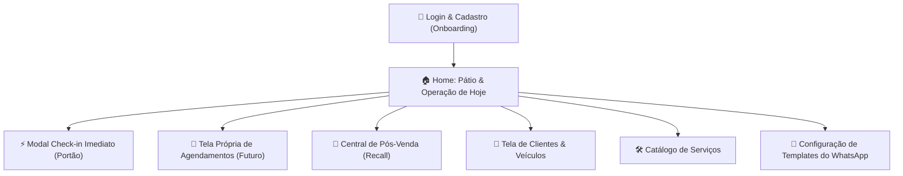

# 📋 Especificação de Requisitos do MVP — GestAuto / Eixo

---

## 1. Visão Geral do Documento

Este documento detalha todos os **Requisitos Funcionais (RF)** divididos por módulo do MVP e os **Requisitos Não-Funcionais (RNF)** do sistema como um todo.

*   **Público-alvo:** Studios automotivos, estéticas de detailing e oficinas premium.
*   **Premissa do MVP:** Usuário único por oficina (proprietário/gestor), operação rápida via celular/tablet, zero custo de APIs externas, agendamentos futuros organizados e pós-venda preditivo ativo.

---

## 2. Mapa de Telas do MVP

---

## 3. Requisitos Funcionais (RF) por Módulo

### 🔐 Módulo 01: Login, Registro & Autenticação (Onboarding da Empresa)

| Identificador | Requisito Funcional |
| :--- | :--- |
| **RF01.1** | O sistema deve permitir que o proprietário faça login utilizando **Email** e **Senha**. |
| **RF01.2** | O sistema deve permitir o **Auto-Cadastro (Registro de Nova Empresa)** contendo obrigatoriamente:  • **Nome do Proprietário**;  • **Email de Acesso** (único no sistema);  • **Senha de Acesso** (mínimo de 6 caracteres);  • **Nome da Empresa / Nome Fantasia**;  • **CNPJ da Empresa** (com validação básica de formato);  • **WhatsApp da Empresa com DDD** (utilizado para comunicação e recebimento de contatos). |
| **RF01.3** | A criação de Empresa e Usuário no cadastro deve ser executada obrigatoriamente em uma **transação atômica (`$transaction`)**, garantindo que nenhum registro órfão seja gravado caso ocorra falha. |
| **RF01.4** | O sistema deve emitir resposta HTTP imediata (`201 Created` ou redirecionamento com cookie de sessão ativo) ao concluir o registro, evitando que a requisição fique pendente (*hang*). |
| **RF01.5** | O sistema deve manter a sessão do usuário autenticada por meio de cookie seguro (`HttpOnly`), sem expirar durante o expediente de trabalho (duração padrão de 7 dias com renovação). |
| **RF01.6** | O sistema deve possuir um botão visível de **Logout** que invalida a sessão local e limpa com exatidão o cookie de credencial (`accessToken`). |
| **RF01.7** | O sistema deve restringir o acesso a todas as telas operacionais exclusivamente a usuários autenticados da própria empresa. |
| **RF01.8** | No MVP, não haverá suporte a múltiplos funcionários ou subcontas; cada empresa cadastrada terá apenas uma credencial ativa de acesso. |

---

### 👥 Módulo 02: Cadastro de Clientes & Veículos

| Identificador | Requisito Funcional |
| :--- | :--- |
| **RF02.1** | O sistema deve permitir cadastrar um cliente contendo obrigatoriamente: **Nome Completo** e **WhatsApp com DDD**. |
| **RF02.2** | O sistema deve validar o formato do número de WhatsApp (DDD + 9 dígitos no padrão brasileiro). |
| **RF02.3** | O sistema deve permitir vincular um ou mais veículos ao cliente, contendo: **Placa**, **Marca**, **Modelo**, **Ano** e **Cor**. |
| **RF02.4** | A **Placa** é o identificador único operacional do carro no sistema, devendo aceitar tanto o padrão antigo (`ABC-1234`) quanto o padrão Mercosul (`ABC1D23`), padronizando em letras maiúsculas. |
| **RF02.5** | O sistema deve fornecer uma barra de busca rápida em tempo real capaz de filtrar por **Placa**, **Nome do Cliente**, **Modelo** ou **WhatsApp**. |
| **RF02.6** | O sistema deve exibir uma gaveta/modal com o histórico completo de serviços já realizados por aquele cliente e por aquele veículo. |

---

### 🛠️ Módulo 03: Catálogo de Serviços

| Identificador | Requisito Funcional |
| :--- | :--- |
| **RF03.1** | O sistema deve permitir cadastrar, editar e inativar serviços oferecidos pelo studio. |
| **RF03.2** | Cada serviço deve conter os seguintes campos:  • **Nome do Serviço** (ex: *Lavagem Técnica*, *Polimento Comercial*, *Vitrificação de Pintura*);  • **Preço Base Sugerido (R$)**;  • **Tempo Estimado de Execução** (em minutos ou horas);  • **Prazo de Retorno para Pós-Venda** (em número de dias, ex: 30, 60, 180 dias);  • **Descrição/Observações** (opcional). |
| **RF03.3** | O sistema deve permitir que o proprietário defina serviços como "Ativos" ou "Inativos", impedindo que serviços inativos apareçam no momento de dar entrada ou agendar veículos. |
| **RF03.4** | O sistema já deve iniciar com 4 serviços básicos pré-sugeridos no primeiro acesso da oficina (*Lavagem Técnica*, *Higienização Interna*, *Polimento Comercial*, *Vitrificação de Pintura*), permitindo alteração imediata. |

---

### 🏠 Módulo 04: Pátio & Operação de Hoje (Tela Inicial / Home)

| Identificador | Requisito Funcional |
| :--- | :--- |
| **RF04.1** | A tela inicial (Home) deve ser o painel de controle operacional do dia, focando **estritamente na data atual (HOJE)** para não poluir a rotina do pátio. |
| **RF04.2** | A Home deve apresentar uma **Visão Mista Limpa** contendo duas seções principais:  1. **Agendados para Hoje:** Lista contendo apenas os veículos com chegada marcada para o dia de hoje.  2. **Pátio / Boxes em Andamento:** Veículos que já estão fisicamente na oficina sendo trabalhados no momento. |
| **RF04.3** | Na lista de **Agendados para Hoje**, deve haver o botão de ação rápida: **"Confirmar Entrada"**. Ao clicar, o agendamento é convertido instantaneamente em uma Ordem de Serviço no pátio ativo sem precisar redigitar dados. |
| **RF04.4** | A Home deve conter o botão fixo de destaque: **`+ Nova Entrada (Check-in)`** para cadastrar carros que chegam de surpresa no portão sem agendamento prévio. |
| **RF04.5** | No formulário de entrada rápida, ao digitar uma **Placa** já existente no banco de dados, o sistema auto-preenche automaticamente os dados do cliente e do veículo. |
| **RF04.6** | O operador seleciona os serviços do catálogo. O sistema calcula a soma automática dos valores, mas **permite ajuste manual livre** do preço final. |
| **RF04.7** | O operador deve informar a **Previsão de Entrega (Data e Horário)** prometida ao cliente. |
| **RF04.8** | O ciclo de vida do veículo no pátio deve seguir os seguintes estados:  • `Aguardando Início` ➔ `Em Execução` ➔ `Pronto para Retirada` ➔ `Entregue`. |
| **RF04.9** | No estado `Pronto para Retirada`, o sistema deve exibir um botão verde em destaque: **"Avisar no WhatsApp"**. |

---

### 📅 Módulo 05: Tela Própria de Agendamentos (Agenda Futura)

| Identificador | Requisito Funcional |
| :--- | :--- |
| **RF05.1** | O sistema deve possuir uma **tela dedicada exclusivamente para Gestão de Agendamentos**, separada da tela inicial. |
| **RF05.2** | A tela de agendamentos deve permitir navegar livremente no calendário e visualizar datas futuras (Amanhã, Próximos 7 Dias, Próximas Semanas ou Meses). |
| **RF05.3** | O sistema deve permitir criar um agendamento futuro contendo:  • **Data e Horário Marcado de Entrada**;  • **Cliente & Veículo** (busca por cliente existente ou cadastro rápido de novo);  • **Serviços Pretendidos** (selecionados do catálogo com valor estimado);  • **Previsão de Saída/Entrega**;  • **Observações do Agendamento** (ex: "cliente vai viajar na sexta", "foco em manchas no capô"). |
| **RF05.4** | A tela deve exibir claramente o **volume de agendamentos por dia**, permitindo ao dono do studio saber se uma data futura já atingiu a capacidade máxima de boxes da oficina. |
| **RF05.5** | O sistema deve permitir **Editar**, **Remarcar Data/Hora** ou **Cancelar** agendamentos futuros. |
| **RF05.6** | O sistema deve disponibilizar um botão para enviar mensagem de confirmação de agendamento no WhatsApp do cliente assim que o horário for marcado. |

---

### 🎯 Módulo 06: Central de Pós-Venda Automático (Motor de Recall)

| Identificador | Requisito Funcional |
| :--- | :--- |
| **RF06.1** | Ao marcar um veículo como `Entregue`, o sistema deve calcular e gravar automaticamente a data do pós-venda: `Data de Entrega + Prazo de Pós-Venda do Serviço realizado`.  *(Caso a OS tenha múltiplos serviços, utiliza o maior prazo de retorno).* |
| **RF06.2** | A tela de Pós-Venda deve apresentar a lista de **"Clientes para Chamar Hoje"** (onde a data de contato é igual ou anterior à data atual e o status do contato estiver pendente). |
| **RF06.3** | Cada card de pós-venda deve exibir: Nome do Cliente, Carro, Último Serviço Realizado, Há quantos dias foi feito e a data de vencimento da revisão. |
| **RF06.4** | O sistema deve conter o botão **"Chamar no WhatsApp"**, que abre o WhatsApp diretamente com a mensagem pré-formatada de pós-venda já personalizada com os dados do cliente. |
| **RF06.5** | O proprietário deve poder atualizar o status do contato com 1 clique:  • `Marcar como Contatado`;  • `Cliente Reagendou` (cria um novo agendamento na tela de agendamentos futuros);  • `Ignorar / Descartar`. |

---

### 💰 Módulo 07: Visualização das Vendas & Fechamento Simples

| Identificador | Requisito Funcional |
| :--- | :--- |
| **RF07.1** | Ao mover o veículo para o estado `Entregue`, o sistema deve exibir uma janela de confirmação de pagamento para registrar a **Forma de Pagamento**:  • *Pix*, *Cartão de Crédito*, *Cartão de Débito*, *Dinheiro* ou *Pendente / A Receber*. |
| **RF07.2** | A tela inicial e a tela de vendas devem apresentar um painel consolidado com as métricas do negócio:  • **Faturamento Hoje (R$)**;  • **Faturamento no Mês (R$)**;  • **Valores a Receber / Pendentes (R$)**;  • **Quantidade de Carros Atendidos no Período**. |
| **RF07.3** | O sistema deve fornecer uma lista de vendas concluídas com filtros simples por data (Hoje, Esta Semana, Este Mês). |

---

### 💬 Módulo 08: Configuração de Templates do WhatsApp

| Identificador | Requisito Funcional |
| :--- | :--- |
| **RF08.1** | O sistema deve disponibilizar uma tela onde o proprietário pode personalizar os textos padrão das mensagens enviadas pelo WhatsApp. |
| **RF08.2** | O sistema deve suportar as 3 categorias essenciais de mensagens:  1. **Confirmação de Agendamento / Entrada**;  2. **Aviso de Carro Pronto (Retirada)**;  3. **Mensagem de Pós-Venda / Recall**. |
| **RF08.3** | O sistema deve substituir dinamicamente as seguintes variáveis/tags no momento do clique:  • `{cliente}` ➔ Primeiro nome do cliente;  • `{carro}` ➔ Modelo do veículo;  • `{placa}` ➔ Placa do veículo;  • `{servicos}` ➔ Lista dos serviços contratados;  • `{valor}` ➔ Valor total formatado em Reais;  • `{oficina}` ➔ Nome da estética ou studio;  • `{pix}` ➔ Chave Pix cadastrada da oficina;  • `{data_agendamento}` ➔ Data e hora agendadas (quando aplicável). |
| **RF08.4** | O acionamento do WhatsApp deve ser feito através de deep linking nativo: `https://wa.me/55{telefone}?text={mensagem_codificada}`, sem dependência de intermediários ou servidores externos de WhatsApp. |

---

## 4. Requisitos Não-Funcionais (RNF)

### ⚡ RNF01 — Desempenho e Velocidade Operacional
*   **RNF01.1:** O fluxo de entrada rápida de um veículo (Check-in) deve ser concluído em **menos de 60 segundos** por um operador treinado.
*   **RNF01.2:** As telas do sistema devem carregar e responder a ações em **menos de 1.5 segundos**, mesmo sob conexão 4G móvel instável.
*   **RNF01.3:** A busca em tempo real de clientes e placas deve ter resposta visual instantânea (latência percebida inferior a 300ms com debounce).

---

### 📱 RNF02 — Usabilidade & Mobile-First
*   **RNF02.1:** A interface deve ser **100% responsiva**, projetada prioritariamente para smartphones (larguras de 360px a 430px) e tablets, sem quebras de layout ou necessidade de rolagem horizontal.
*   **RNF02.2:** Todos os botões principais de ação (Confirmar Entrada, Chamar no WhatsApp, Avançar Fase) devem ter área de toque mínima de **44x44 pixels**, facilitando o uso com uma única mão no pátio.
*   **RNF02.3:** A interface deve possuir alto contraste visual e tipografia nítida para garantir leitura confortável em ambientes externos e sob luz solar.

---

### 🔒 RNF03 — Segurança e Privacidade
*   **RNF03.1:** A autenticação deve emitir tokens JWT transmitidos exclusivamente via cookies seguros com atributos `HttpOnly`, `SameSite=Lax` e `Secure` (em produção).
*   **RNF03.2:** Todas as senhas de usuários devem ser criptografadas utilizando o algoritmo **bcrypt** com fator de custo (*salt rounds*) no mínimo de 12, executado de forma assíncrona (`await bcrypt.compare`) para não bloquear o Event Loop do Node.js.
*   **RNF03.3:** Todas as entradas de dados (corpo da requisição, parâmetros de URL e formulários) devem ser rigorosamente sanitizadas e validadas através de schemas do **Zod**, prevenindo ataques de injeção e XSS.
*   **RNF03.4:** O sistema deve garantir o isolamento estrito de dados entre empresas (*Multi-tenant* lógico por `empresaId`). Nenhuma oficina pode consultar, listar ou alterar dados de outra oficina.

---

### 🛡️ RNF04 — Confiabilidade & Integridade de Dados
*   **RNF04.1:** Qualquer fluxo que envolva persistência dependente (ex: criar Empresa + Usuário, ou Cliente + Veículo + OS) deve ser executado obrigatoriamente dentro de uma **transação de banco de dados (`$transaction` do Prisma)**. Se qualquer etapa falhar, nenhuma alteração será gravada.
*   **RNF04.2:** O banco de dados PostgreSQL deve possuir índices explícitos nos campos de busca frequente (`placa`, `email`, `empresa_id`, `status`, `data_contato`).

---

### 💸 RNF05 — Custo Operacional Zero de Mensageria
*   **RNF05.1:** O sistema não dependerá de nenhuma API paga ou não oficial de WhatsApp (Evolution API, Z-API, Meta Cloud API) para o MVP. Toda comunicação será baseada no protocolo padrão `wa.me` executado pelo cliente no seu próprio aparelho, eliminando custos de servidores de mensageria e risco de banimento de chips.

---

### 🏗️ RNF06 — Arquitetura e Manutenibilidade do Código
*   **RNF06.1:** O frontend deve ser construído utilizando **Next.js (App Router)** com **TypeScript**, **Tailwind CSS** e biblioteca de componentes acessíveis **shadcn/ui**.
*   **RNF06.2:** O backend deve ser mantido em **Fastify**, modularizado em camadas claras: *Routes*, *Controllers*, *Services* e *Database (Prisma)*, sem regras de negócio acopladas aos controladores HTTP.
*   **RNF06.3:** O projeto deve ser estruturado como um monorepo simples e organizado: `/app` (backend Fastify) e `/frontend` (Next.js).
