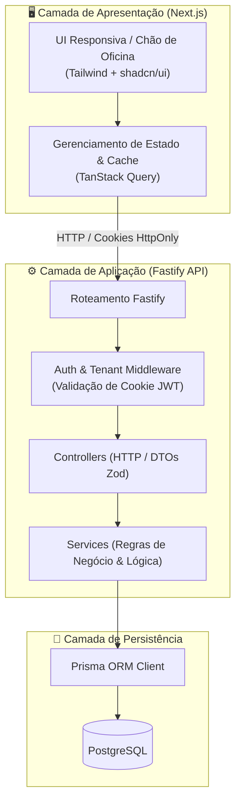
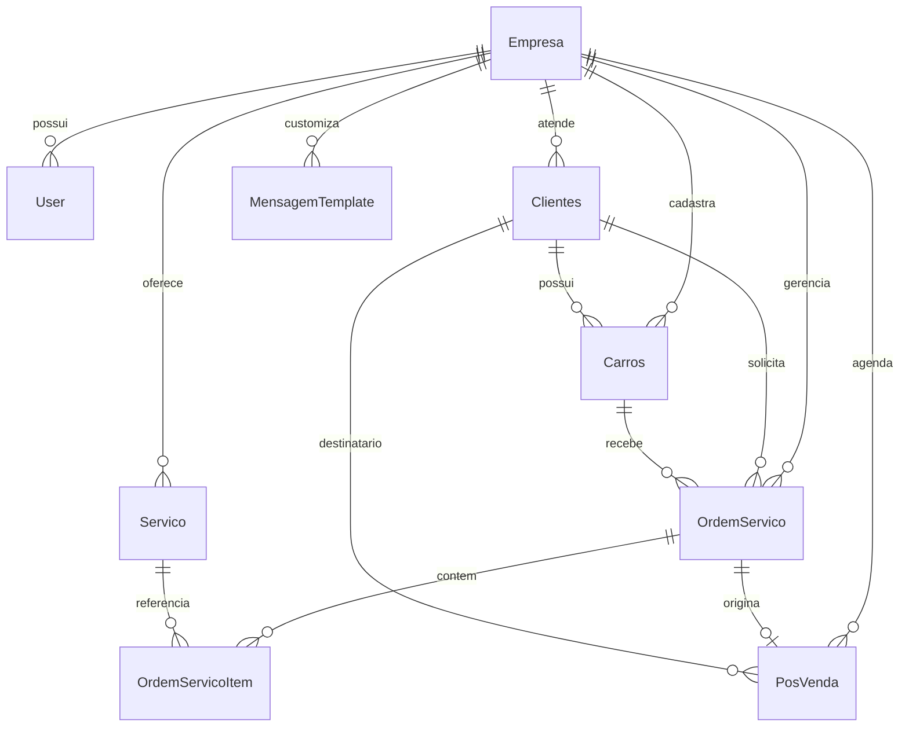
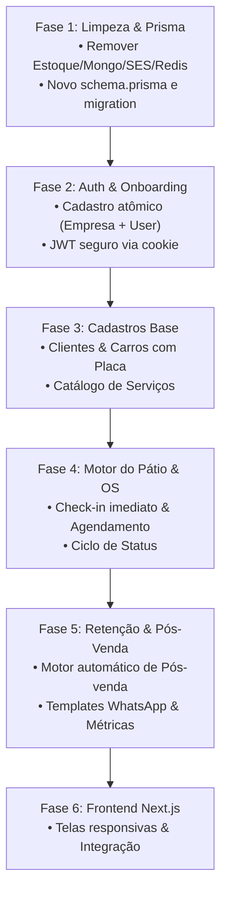

# 📐 Software Design Document (SDD) — GestAuto / Eixo MVP

---

## 1. Visão Geral da Arquitetura do Sistema

O **GestAuto / Eixo** é estruturado como uma aplicação monorepo moderna, composta por uma API RESTful de alta performance em **Fastify (Node.js + TypeScript)** e uma interface web responsiva em **Next.js (App Router + Tailwind CSS + shadcn/ui)**, persistindo dados em **PostgreSQL** através do **Prisma ORM**.



### 1.1 Princípios de Design do Backend
1. **Isolamento de Tenant Simplificado:** Todas as tabelas de dados de negócio pertencem a uma `Empresa` via `empresa_id`.
2. **Autenticação Leve & Segura (Sem Redis):** Sessões autenticadas puramente via JWT stateless assinado, trafegado em cookie seguro `HttpOnly` com proteção contra CSRF (`SameSite=Lax`).
3. **Transações Atômicas Obrigatórias:** Qualquer fluxo que grave em mais de uma tabela dependente utiliza `$prisma.$transaction`.
4. **Validação Estrita na Borda:** Toda requisição passa por schemas **Zod** antes de atingir os serviços.

---

## 2. Design de Dados & Refatoração do Banco (`schema.prisma`)

### 2.1 O que será removido do Banco Atual
*   ❌ Tabelas de Estoque e Produtos (`Estoque`, `Produtos`, `ProdutoEstoque`, `ItemVenda`).
*   ❌ Tabelas de Assinatura e Faturamento SaaS (`Assinatura`, `Plano`, `Fatura`) — *guardadas para V2*.
*   ❌ Obrigatoriedade de `UsuarioEmpresa` e `funcionario_id` em clientes e carros (o MVP é usuário único do proprietário).

### 2.2 Diagrama Entidade-Relacionamento do MVP (DER)



### 2.3 Especificação dos Modelos Prisma Refatorados

```prisma
datasource db {
  provider = "postgresql"
  url      = env("DATABASE_URL")
}

generator client {
  provider = "prisma-client-js"
}

// 🏢 EMPRESA (TENANT)
model Empresa {
  id               String             @id @default(uuid())
  nome_fantasia    String             @db.VarChar(255)
  razao_social     String?            @db.VarChar(255)
  cnpj             String             @unique @db.VarChar(20)
  email            String             @unique @db.VarChar(255)
  whatsapp         String             @db.VarChar(20)
  chave_pix        String?            @db.VarChar(255)
  ativo            Boolean            @default(true)
  createdAt        DateTime           @default(now())
  updatedAt        DateTime           @updatedAt

  users            User[]
  clientes         Clientes[]
  carros           Carros[]
  servicos         Servico[]
  ordens_servico   OrdemServico[]
  pos_vendas       PosVenda[]
  templates        MensagemTemplate[]
}

// 👤 USUÁRIO (PROPRIETÁRIO)
model User {
  id               String             @id @default(uuid())
  nome             String             @db.VarChar(255)
  email            String             @unique @db.VarChar(255)
  senha            String             @db.VarChar(255)
  empresa_id       String
  ativo            Boolean            @default(true)
  createdAt        DateTime           @default(now())
  updatedAt        DateTime           @updatedAt

  empresa          Empresa            @relation(fields: [empresa_id], references: [id], onDelete: Cascade)
}

// 👥 CLIENTES
model Clientes {
  id               String             @id @default(uuid())
  nome             String             @db.VarChar(255)
  whatsapp         String             @db.VarChar(20)
  empresa_id       String
  ativo            Boolean            @default(true)
  createdAt        DateTime           @default(now())
  updatedAt        DateTime           @updatedAt

  empresa          Empresa            @relation(fields: [empresa_id], references: [id], onDelete: Cascade)
  carros           Carros[]
  ordens_servico   OrdemServico[]
  pos_vendas       PosVenda[]

  @@index([empresa_id, nome])
  @@index([empresa_id, whatsapp])
}

// 🚗 CARROS
model Carros {
  id               String             @id @default(uuid())
  placa            String             @db.VarChar(10)
  marca            String             @db.VarChar(100)
  modelo           String             @db.VarChar(100)
  ano              Int
  cor              String             @db.VarChar(50)
  cliente_id       String
  empresa_id       String
  createdAt        DateTime           @default(now())
  updatedAt        DateTime           @updatedAt

  cliente          Clientes           @relation(fields: [cliente_id], references: [id], onDelete: Cascade)
  empresa          Empresa            @relation(fields: [empresa_id], references: [id], onDelete: Cascade)
  ordens_servico   OrdemServico[]
  pos_vendas       PosVenda[]

  @@unique([empresa_id, placa])
  @@index([empresa_id, placa])
}

// 🛠️ CATÁLOGO DE SERVIÇOS
model Servico {
  id               String             @id @default(uuid())
  nome             String             @db.VarChar(255)
  descricao        String?            @db.VarChar(500)
  preco_base       Decimal            @db.Decimal(10, 2)
  duracao_minutos  Int                @default(60)
  tempo_pos_venda  Int                @default(30) // Dias até o recall de pós-venda
  ativo            Boolean            @default(true)
  empresa_id       String
  createdAt        DateTime           @default(now())
  updatedAt        DateTime           @updatedAt

  empresa          Empresa            @relation(fields: [empresa_id], references: [id], onDelete: Cascade)
  itens_os         OrdemServicoItem[]
  pos_vendas       PosVenda[]

  @@index([empresa_id, ativo])
}

// 📋 ORDEM DE SERVIÇO & AGENDAMENTO
model OrdemServico {
  id               String             @id @default(uuid())
  empresa_id       String
  cliente_id       String
  carro_id         String
  status           StatusOrdemServico @default(AGENDADO)
  data_agendamento DateTime?          // Para agendamentos futuros
  hora_entrada     DateTime?          // Quando o carro entra fisicamente no pátio
  previsao_entrega DateTime?          // Prazo combinado com o cliente
  data_entrega     DateTime?          // Quando o carro é finalizado e entregue
  valor_total      Decimal            @default(0) @db.Decimal(10, 2)
  metodo_pagamento MetodoPagamento?   // Registrado na entrega
  observacoes      String?            @db.Text
  createdAt        DateTime           @default(now())
  updatedAt        DateTime           @updatedAt

  empresa          Empresa            @relation(fields: [empresa_id], references: [id], onDelete: Cascade)
  cliente          Clientes           @relation(fields: [cliente_id], references: [id], onDelete: Cascade)
  carro            Carros             @relation(fields: [carro_id], references: [id], onDelete: Cascade)
  itens            OrdemServicoItem[]
  pos_venda        PosVenda?

  @@index([empresa_id, status])
  @@index([empresa_id, data_agendamento])
  @@index([empresa_id, data_entrega])
}

enum StatusOrdemServico {
  AGENDADO             // Marcado para o futuro
  AGUARDANDO_INICIO    // No pátio esperando vez
  EM_EXECUCAO          // Nos boxes sendo trabalhado
  PRONTO_RETIRADA      // Finalizado, aguardando o cliente buscar
  ENTREGUE             // Entregue e pago
  CANCELADO            // Cancelado
}

enum MetodoPagamento {
  PIX
  CARTAO_CREDITO
  CARTAO_DEBITO
  DINHEIRO
  A_RECEBER
}

// 🧾 ITENS DA ORDEM DE SERVIÇO
model OrdemServicoItem {
  id               String             @id @default(uuid())
  ordem_servico_id String
  servico_id       String
  preco_aplicado   Decimal            @db.Decimal(10, 2)

  ordem_servico    OrdemServico       @relation(fields: [ordem_servico_id], references: [id], onDelete: Cascade)
  servico          Servico            @relation(fields: [servico_id], references: [id])
}

// 🎯 CENTRAL DE PÓS-VENDA
model PosVenda {
  id               String             @id @default(uuid())
  empresa_id       String
  cliente_id       String
  carro_id         String
  servico_id       String
  ordem_servico_id String             @unique
  data_contato     DateTime           // Data programada para o recall
  status           StatusPosVenda     @default(PENDENTE)
  observacoes      String?            @db.Text
  createdAt        DateTime           @default(now())
  updatedAt        DateTime           @updatedAt

  empresa          Empresa            @relation(fields: [empresa_id], references: [id], onDelete: Cascade)
  cliente          Clientes           @relation(fields: [cliente_id], references: [id], onDelete: Cascade)
  carro            Carros             @relation(fields: [carro_id], references: [id], onDelete: Cascade)
  servico          Servico            @relation(fields: [servico_id], references: [id], onDelete: Cascade)
  ordem_servico    OrdemServico       @relation(fields: [ordem_servico_id], references: [id], onDelete: Cascade)

  @@index([empresa_id, status, data_contato])
}

enum StatusPosVenda {
  PENDENTE
  CONTATADO
  REAGENDADO
  IGNORADO
}

// 💬 TEMPLATES DE MENSAGENS WHATSAPP
model MensagemTemplate {
  id               String             @id @default(uuid())
  empresa_id       String
  tipo             TipoTemplate
  texto            String             @db.Text
  createdAt        DateTime           @default(now())
  updatedAt        DateTime           @updatedAt

  empresa          Empresa            @relation(fields: [empresa_id], references: [id], onDelete: Cascade)

  @@unique([empresa_id, tipo])
}

enum TipoTemplate {
  CONFIRMACAO_AGENDAMENTO
  CARRO_PRONTO
  POS_VENDA_RECALL
}
```

---

## 3. Contratos de API REST (Endpoints & DTOs)

### 🔐 3.1 Autenticação & Onboarding
*   `POST /api/auth/register`
    *   **Body:** `{ nome, email, senha, nomeFantasia, cnpj, whatsapp }`
    *   **Lógica:** Executa `$transaction` criando `Empresa` + `User` com senha em hash bcrypt. Cria os templates padrão de WhatsApp e os 4 serviços iniciais sugeridos.
    *   **Resposta:** `201 Created` + Cookie `accessToken`.
*   `POST /api/auth/login`
    *   **Body:** `{ email, senha }`
    *   **Resposta:** `200 OK` + Cookie `accessToken` + DTO com dados da empresa e usuário.
*   `POST /api/auth/logout`
    *   **Resposta:** `200 OK` + Limpa o cookie `accessToken`.
*   `GET /api/auth/me`
    *   **Resposta:** Perfil do usuário logado e dados da empresa.

---

### 👥 3.2 Clientes & Veículos
*   `GET /api/clientes` ➔ Lista clientes com contagem de carros e histórico (suporta `?busca=...`).
*   `POST /api/clientes` ➔ Cria cliente + veículo opcional em transação.
*   `GET /api/clientes/:id` ➔ Detalhe do cliente com lista de veículos e histórico de OS.
*   `PUT /api/clientes/:id` ➔ Atualiza dados do cliente.
*   `POST /api/clientes/:id/carros` ➔ Adiciona novo carro para cliente existente.
*   `GET /api/carros/busca-placa/:placa` ➔ Busca rápida por placa para auto-complete na entrada do pátio.

---

### 🛠️ 3.3 Catálogo de Serviços
*   `GET /api/servicos` ➔ Lista todos os serviços ativos da empresa.
*   `POST /api/servicos` ➔ Cadastra novo serviço com `tempo_pos_venda`.
*   `PUT /api/servicos/:id` ➔ Atualiza preço, duração ou prazo de pós-venda.
*   `DELETE /api/servicos/:id` ➔ Desativa serviço (soft delete: `ativo = false`).

---

### 🚗 3.4 Pátio, Agendamentos & Ordens de Serviço
*   `GET /api/patio/hoje`
    *   **Retorno:** `{ agendadosHoje: [...], emAndamento: [...] }` (Visão mista da Home).
*   `GET /api/agendamentos`
    *   **Query params:** `?dataInicio=...&dataFim=...` (Para navegação na tela própria de agendamentos futuros).
*   `POST /api/ordens-servico`
    *   **Criação direta:** Check-in imediato no portão (`status: AGUARDANDO_INICIO`) OU Agendamento futuro (`status: AGENDADO`).
    *   **Body:** `{ clienteId, carroId, servicosIds: [...], valorTotal, previsaoEntrega, observacoes, dataAgendamento? }`.
*   `PATCH /api/ordens-servico/:id/status`
    *   **Body:** `{ status: "EM_EXECUCAO" | "PRONTO_RETIRADA" | "ENTREGUE", metodoPagamento?: "PIX" }`.
    *   **Regra Atômica:** Se o status for alterado para `ENTREGUE`, o sistema calcula automaticamente a maior data de pós-venda dos serviços da OS e insere na tabela `PosVenda`.

---

### 🎯 3.5 Central de Pós-Venda
*   `GET /api/pos-venda/pendentes` ➔ Lista clientes onde `data_contato <= HOJE` e `status == PENDENTE`.
*   `PATCH /api/pos-venda/:id/status` ➔ Atualiza status para `CONTATADO`, `REAGENDADO` ou `IGNORADO`.

---

### 💬 3.6 Templates de WhatsApp & Links
*   `GET /api/templates-whatsapp` ➔ Retorna os 3 templates da empresa.
*   `PUT /api/templates-whatsapp/:tipo` ➔ Atualiza o texto de um template.
*   `GET /api/ordens-servico/:id/whatsapp-link?tipo=CARRO_PRONTO` ➔ Retorna a URL pronta `https://wa.me/...` com todas as tags dinâmicas já resolvidas.

---

### 💰 3.7 Métricas da Home (Resumo do Dia)
*   `GET /api/metricas/resumo-dia`
    *   **Retorno:**
        ```json
        {
          "faturadoHoje": 1450.00,
          "faturadoMes": 18200.00,
          "valoresPendentes": 350.00,
          "carrosNoPatioHoje": 4,
          "posVendaPendenteHoje": 3
        }
        ```

---

## 4. Plano de Implementação em Fases e Partes

A execução técnica seguirá uma ordem de dependência estrita:



---

### 🧱 FASE 1: Limpeza & Novo Schema do Prisma
*   **Parte 1.1:** Deletar código morto e desnecessário:
    *   `app/plugin/mongodb.ts`, `app/plugin/ses.ts`, `app/plugin/redis.ts`.
    *   `app/routes/estoque.routes.ts`, `produto.routes.ts`, `email.routes.ts`, `otp.routes.ts`.
    *   Controllers e services correspondentes a estoque e produtos.
*   **Parte 1.2:** Atualizar o `prisma/schema.prisma` com o modelo enxuto e seguro especificado na Seção 2.3.
*   **Parte 1.3:** Executar a migração do banco de dados PostgreSQL (`npx prisma migrate dev` ou `db push`).

---

### 🔐 FASE 2: Módulo de Auth & Onboarding da Empresa
*   **Parte 2.1:** Atualizar schemas do Zod (`registroModel.ts`, `loginModel.ts`).
*   **Parte 2.2:** Refatorar `authController.ts` e `authService`:
    *   Registro atômico da Empresa + Usuário com `bcrypt` assíncrono.
    *   Criação automática dos templates iniciais de WhatsApp e serviços padrão.
    *   Resposta HTTP `201 Created` garantida com cookie de sessão.
*   **Parte 2.3:** Refatorar `authMiddleware` para validação de JWT stateless via cookies, injetando `empresaId` na requisição sem dependência de Redis.

---

### 👥 FASE 3: Módulo de Clientes, Carros & Catálogo de Serviços
*   **Parte 3.1:** Refatorar `clientService` e `carroService`:
    *   Remover vínculo obrigatório de funcionários.
    *   Busca rápida de placa com normalização para maiúsculas.
    *   Filtro unificado e histórico de atendimentos.
*   **Parte 3.2:** Ajustar `servicoService` para o modelo enxuto (Preço base, tempo de execução e dias de pós-venda).

---

### 🚗 FASE 4: Motor de Pátio, Agendamentos & Ordem de Serviço
*   **Parte 4.1:** Criar `ordemServico.service.ts` e `ordemServico.controller.ts`:
    *   Criação de entrada imediata no pátio (`status: AGUARDANDO_INICIO`).
    *   Criação de agendamento futuro (`status: AGENDADO`).
*   **Parte 4.2:** Implementar as rotas de pátio:
    *   `GET /api/patio/hoje` (agendados de hoje + carros nos boxes).
    *   `GET /api/agendamentos` (agenda futura por intervalo de datas).
*   **Parte 4.3:** Implementar transição de status (`AGUARDANDO_INICIO` ➔ `EM_EXECUCAO` ➔ `PRONTO_RETIRADA` ➔ `ENTREGUE` com registro de pagamento).

---

### 🎯 FASE 5: Pós-Venda, Templates de WhatsApp & Métricas
*   **Parte 5.1:** Criar o gatilho automático de Pós-Venda: ao marcar OS como `ENTREGUE`, grava na tabela `PosVenda`.
*   **Parte 5.2:** Criar rotas da Central de Pós-Venda (`GET /api/pos-venda/pendentes` e atualização de status).
*   **Parte 5.3:** Criar rotas de Templates de WhatsApp e gerador de links `wa.me` com substituição de tags dinâmicas.
*   **Parte 5.4:** Criar rota de métricas consolidadas (`GET /api/metricas/resumo-dia`).

---

### 🖥️ FASE 6: Frontend Next.js & Telas do MVP
*   **Parte 6.1:** Inicializar a pasta `/frontend` com Next.js (App Router), Tailwind CSS e shadcn/ui.
*   **Parte 6.2:** Construção da Tela de Login & Auto-Cadastro.
*   **Parte 6.3:** Construção da Home (Painel Misto: Agendados de Hoje + Boxes Ativos + CTA Rápido de Entrada).
*   **Parte 6.4:** Construção da Tela Própria de Agendamentos Futuros.
*   **Parte 6.5:** Construção das Telas de Clientes, Catálogo de Serviços, Central de Pós-Venda e Configurações de WhatsApp.
*   **Parte 6.6:** Homologação de ponta a ponta e testes de fluxo com dados simulados de estéticas reais.
